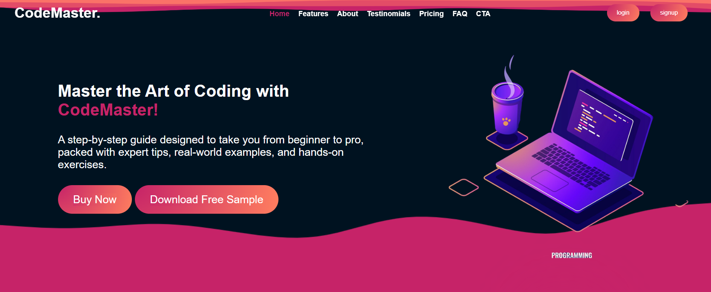

#WebDeveloper #Task01

# Codemaster Landing Page

## Overview
The Codemaster Landing Page is a visually appealing and responsive front-end project designed to promote a digital product named Codemaster. It is built using HTML, CSS, and JavaScript, providing a user-friendly interface with sections for Home, About, Features, Testimonials, Pricing, FAQs, a Call-to-Action (CTA), and a Footer.

## Screenshot



*Above: A preview of the Codemaster Landing Page.*

## Features
- **Home Section**: A welcoming hero banner introducing the Codemaster product.
- **About Section**: Highlights the purpose and unique selling points of Codemaster.
- **Features Section**: Lists the core features of the product, showcasing its value.
- **Testimonials Section**: Displays feedback and reviews from satisfied users.
- **Pricing Section**: Provides pricing tiers and package details.
- **FAQ Section**: Answers common questions to assist potential customers.
- **Call-to-Action Section**: Encourages users to take the next step, such as signing up or purchasing.
- **Footer**: Contains additional navigation links, contact information, and social media icons.

## Technologies Used
- **HTML5**: For the structure and semantic markup of the webpage.
- **CSS3**: For styling and layout, including responsiveness.
- **JavaScript**: For interactive elements like form validation and FAQ toggles.

## Installation
1. Clone this repository to your local machine:
   ```bash
   git clone https://github.com/workdotnisha/FutureIntern_WD_01.git
   ```
2. Navigate to the project directory:
   ```bash
   cd FutureIntern_WD_01
   ```
3. Open the `index.html` file in your browser to view the landing page.

## File Structure
```
Codemaster Landing Page
|
|-- index.html         # Main HTML file
|-- css/
|   |-- style.css      # CSS file for styling
|-- js/
|   |-- script.js      # JavaScript file for interactivity
|-- assets/
|   |-- images/        # Images used in the project
```

## Usage
- Open the landing page in any modern web browser.
- Navigate through the sections to explore the content and design.
- Use the CTA buttons to simulate user engagement.

## Future Enhancements
- Add form functionality for user sign-up or inquiries.
- Integrate animations for smoother transitions.
- Optimize for better performance and SEO.

## Contributing
Contributions are welcome! Please follow these steps:
1. Fork this repository.
2. Create a new branch for your feature/bug fix.
3. Commit your changes with clear and descriptive messages.
4. Push your changes to your fork.
5. Submit a pull request to the main branch.

## License
This project is licensed under the MIT License. See the LICENSE file for details.

## Contact
For any queries or feedback, please contact:
- **Name**: Nisha
- **Email**: workdotnisha@gmail.com
- **GitHub**: [workdotnisha](https://github.com/workdotnisha)

